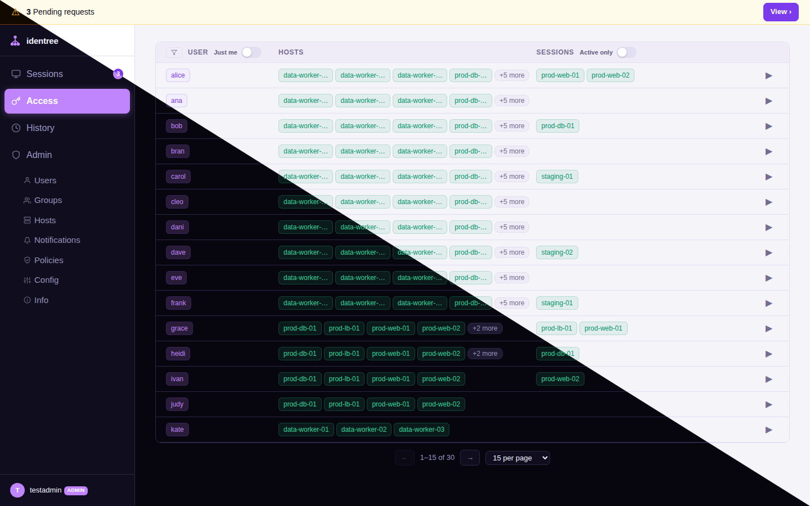

# identree

**identree** bridges your identity provider to Linux. Type `sudo` and approve it on your phone. SSH in without a password. No RADIUS, no password sprawl, no "just disable sudo" compromises.

It is a single binary (or Docker container) that runs on one server and deploys a small PAM helper to each managed host.

---

## The problem

Your IdP handles web app logins beautifully — passkeys, MFA, SSO. But your servers still use Unix passwords. `sudo` prompts for a password that never changes or gets shared. SSH keys are copied everywhere. There is no audit trail.

identree fixes this by routing every `sudo` invocation and SSH login through your IdP's approval flow.

---

## How it works

```
User runs sudo
      │
      ▼
PAM helper (identree) ──► identree server ──► OIDC approval page
      │                                              │
      │                          User approves on phone/browser
      │                                              │
      └──────── sudo succeeds ◄──────────────────────┘
```

1. User runs `sudo` on a managed host.
2. The PAM helper calls the identree server and blocks.
3. The user sees an approval prompt from their IdP.
4. They approve — `sudo` succeeds. They deny — `sudo` fails. No password exchanged.

---

## Deployment modes

identree has two modes. See [docs/deployment-modes.md](docs/deployment-modes.md) for full details and sssd config examples.

### Full mode — identree + PocketID

Use this if you are starting fresh or already use [PocketID](https://github.com/pocket-id/pocket-id). identree acts as your LDAP server, sudo policy engine, and PAM auth bridge in one process. No separate LDAP server needed.

**Requires:** PocketID with an admin API key.

When mTLS is enabled (`IDENTREE_MTLS_CA_CERT` and `IDENTREE_LDAP_TLS_CA_CERT` are set), identree also serves LDAP over TLS on port 636 with mutual TLS client certificate authentication. Clients must present a valid certificate signed by the configured CA. Every certificate issued by the embedded CA is logged with its serial number to the audit stream (see [docs/audit-streaming.md](docs/audit-streaming.md)).

### PAM bridge mode — identree alongside your existing stack

Use this if you already have LDAP (Authentik, Kanidm, lldap, OpenLDAP, etc.) and just want to add passkey-gated PAM auth on top. Your existing LDAP continues to handle user/group resolution. identree handles only the PAM challenge flow, and optionally serves `ou=sudoers` for sudo policy management.

**Requires:** Any OIDC-compliant IdP. An existing LDAP server for user/group resolution.

---

## Quick start

This walks through a full mode deployment (PocketID + identree) using Docker Compose.

### Step 1 — Start PocketID

Copy the example compose file and start PocketID first:

```sh
cp docker-compose.example.yml docker-compose.yml
mkdir config
docker compose up pocketid -d
```

Open PocketID at `http://localhost:1411` (or your configured `APP_URL`) and complete the initial setup to create your admin account.

### Step 2 — Configure PocketID

In PocketID:

1. **Create an OIDC client** (OIDC Clients → New):
   - Redirect URL: `https://identree.example.com/callback`
   - Note the **Client ID** and **Client Secret**

2. **Create an API key** (Settings → API Keys → New):
   - Note the key value

3. **Create an admin group** named `admins` (or whatever you set in `IDENTREE_ADMIN_GROUPS`) and add your user to it.

### Step 3 — Configure identree

Edit `docker-compose.yml` and fill in:

```yaml
IDENTREE_OIDC_CLIENT_ID: "your-client-id"
IDENTREE_OIDC_CLIENT_SECRET: "your-client-secret"
IDENTREE_POCKETID_API_KEY: "your-api-key"
IDENTREE_EXTERNAL_URL: "https://identree.example.com"
IDENTREE_SHARED_SECRET: "$(openssl rand -hex 32)"
IDENTREE_LDAP_BASE_DN: "dc=example,dc=com"
IDENTREE_ESCROW_ENCRYPTION_KEY: "$(openssl rand -hex 32)"
```

Also update `APP_URL` in the pocketid section and `IDENTREE_OIDC_ISSUER_PUBLIC_URL` to match.

### Step 4 — Start identree

```sh
docker compose up identree -d
docker compose logs -f identree   # watch for startup errors
```

Open `https://identree.example.com` and log in with your PocketID account. You should land on the identree dashboard.

### Step 5 — Install on a managed host

**Option A — Deploy directly from the admin UI (recommended)**

Go to **Hosts → Deploy** in the identree admin UI. Fill in the target hostname, SSH user, and paste in a private key with SSH access to the host. identree SSHes in, runs the installer, and streams the output back in real time. Once complete the host appears in the Hosts list automatically.

**Option B — Run the installer manually**

On the host:

```sh
curl -fsSL https://identree.example.com/install.sh | sudo bash
```

Or fetch the script first to inspect it, then run it:

```sh
curl -fsSL https://identree.example.com/install.sh -o install.sh
less install.sh   # review
sudo bash install.sh
```

The installer downloads the identree binary, writes `/etc/identree/client.conf` with the server URL and shared secret, configures `/etc/pam.d/sudo`, installs auditd monitoring rules (if auditd is present), and generates a local break-glass password.

### Step 6 — Register a passkey and try it

Log into PocketID on the host's user account and register a passkey. Then try:

```sh
sudo whoami
```

A challenge notification appears (if configured) or the user opens `https://identree.example.com` — they approve, and `sudo` succeeds.

---

## The admin UI

The dashboard at `https://identree.example.com` provides:

- **Dashboard** — live pending challenges with one-click approve/reject; auto-refreshes via SSE
- **Sessions** — active approved sessions; revoke or extend individually or in bulk; "Just me" toggle to filter your own sessions
- **Access** — per-host access log with user/host/time; exportable
- **History** — full audit log of all sudo events; filterable by user, host, event type
- **Hosts** — registered hosts; install new hosts, rotate break-glass passwords, remove hosts
- **Users** — PocketID user list (full mode); manage SSH public key claims per user
- **Groups** — PocketID group list (full mode); manage sudo policy claims per group
- **Admin** — server info, live configuration editor, restart

The **Configuration** page (`/admin/config`) lets you change most settings without restarting. Secrets (shared secret, API keys, tokens) are env-only and cannot be written from the UI.

[](docs/screenshots/)

---

## Persistent state

All server state files default to `/config/`. Mount a persistent volume there:

```yaml
volumes:
  - ./config:/config
```

| File | Contents |
|---|---|
| `/config/sessions.json` | Active approved sessions (survives restarts) |
| `/config/uidmap.json` | UID/GID assignments for LDAP users (full mode) |
| `/config/hosts.json` | Registered host registry |
| `/config/sudorules.json` | Sudo rules (bridge mode) |
| `/config/notification-channels.json` | Notification channel definitions |
| `/config/admin-notifications.json` | Per-admin notification preferences |
| `/config/approval-policies.json` | Approval policy rules (per-host/per-user/per-group overrides) |

Override any path with the corresponding `IDENTREE_*_FILE` environment variable.

---

## Configuration reference

### Server (`/etc/identree/identree.conf` or environment)

#### OIDC / Authentication

| Variable | Default | Description |
|---|---|---|
| `IDENTREE_OIDC_ISSUER_URL` | — | **Required.** OIDC issuer URL |
| `IDENTREE_OIDC_ISSUER_PUBLIC_URL` | — | Public-facing OIDC URL (split internal/external routing) |
| `IDENTREE_OIDC_CLIENT_ID` | — | **Required.** OIDC client ID |
| `IDENTREE_OIDC_CLIENT_SECRET` | — | **Required.** OIDC client secret |
| `IDENTREE_OIDC_INSECURE_SKIP_VERIFY` | `false` | Skip TLS certificate verification for the OIDC issuer |
| `IDENTREE_OIDC_ENFORCE_IP_BINDING` | `false` | Bind sessions to the originating IP address |

#### SAML IdPs (via OIDC bridge)

identree authenticates exclusively via OIDC. If your organization uses a SAML-only IdP, deploy an OIDC-to-SAML bridge (Keycloak, Authentik, or Dex) between your IdP and identree. See [`docs/saml-bridge.md`](docs/saml-bridge.md) for architecture and configuration details.

#### PocketID API (full mode only)

| Variable | Default | Description |
|---|---|---|
| `IDENTREE_POCKETID_API_KEY` | — | **Required (full mode).** PocketID admin API key |
| `IDENTREE_POCKETID_API_URL` | `IDENTREE_OIDC_ISSUER_URL` | Internal PocketID API URL |

#### HTTP server

| Variable | Default | Description |
|---|---|---|
| `IDENTREE_EXTERNAL_URL` | — | **Required.** Public-facing URL of identree |
| `IDENTREE_LISTEN_ADDR` | `:8090` | HTTP listen address |
| `IDENTREE_INSTALL_URL` | `IDENTREE_EXTERNAL_URL` | URL embedded in install scripts (split-horizon DNS) |
| `IDENTREE_SHARED_SECRET` | — | **Required.** HMAC secret shared with PAM clients |
| `IDENTREE_HMAC_SECRET` | — | Separate HMAC secret for internal token signing (defaults to `IDENTREE_SHARED_SECRET`) |
| `IDENTREE_SESSION_SECRET` | (SharedSecret) | Signs session cookies and CSRF tokens. Falls back to SharedSecret if unset. |
| `IDENTREE_ESCROW_SECRET` | (SharedSecret) | Signs break-glass escrow HMAC tokens. Falls back to SharedSecret if unset. |
| `IDENTREE_LDAP_SECRET` | (SharedSecret) | Derives per-host LDAP bind passwords. Falls back to SharedSecret if unset. Unnecessary when mTLS is enabled. |
| `IDENTREE_API_KEYS` | — | Comma-separated API bearer tokens for programmatic access |
| `IDENTREE_METRICS_TOKEN` | — | Bearer token for the `/metrics` endpoint |

> **Split secrets:** Production deployments should set independent secrets for each trust domain. Compromise of one secret does not affect the others.

#### TLS / mTLS

| Variable | Default | Description |
|---|---|---|
| `IDENTREE_TLS_CERT_FILE` | — | Path to TLS certificate file for HTTPS listener |
| `IDENTREE_TLS_KEY_FILE` | — | Path to TLS private key file for HTTPS listener |
| `IDENTREE_MTLS_CA_CERT` | — | Path to CA certificate for verifying client certificates (enables mTLS) |
| `IDENTREE_MTLS_CA_KEY` | — | Path to CA key for issuing client certificates |
| `IDENTREE_MTLS_CERT_TTL` | `8760h` | Validity duration for issued client certificates (default: 1 year) |

#### Challenge / session flow

| Variable | Default | Description |
|---|---|---|
| `IDENTREE_CHALLENGE_TTL` | `120s` | How long a pending challenge lives |
| `IDENTREE_GRACE_PERIOD` | `0` | Skip re-auth if user approved on this host within this window |
| `IDENTREE_ONE_TAP_MAX_AGE` | `24h` | Max PocketID session age for silent one-tap approval |

#### Justification

| Variable | Default | Description |
|---|---|---|
| `IDENTREE_REQUIRE_JUSTIFICATION` | `false` | Require a written justification for every elevation |
| `IDENTREE_JUSTIFICATION_CHOICES` | — | Comma-separated preset choices (defaults to: Routine maintenance, Incident response, Deployment, Debugging / troubleshooting, Security investigation, Configuration change) |

See [docs/justification.md](docs/justification.md) for full details including the terminal prompt flow and `SUDO_REASON` env var.

#### Admin access

| Variable | Default | Description |
|---|---|---|
| `IDENTREE_ADMIN_GROUPS` | — | Comma-separated OIDC groups with admin UI access |
| `IDENTREE_APPROVAL_POLICIES_FILE` | `/config/approval-policies.json` | Path to the approval policies JSON file (per-host/per-user rules) |

Approval policies let you define per-host, per-user, and per-group rules that override the global challenge/session defaults. Policies can require additional approvers, enforce justification, set custom TTLs, or auto-approve/deny specific combinations. See [docs/approval-policies.md](docs/approval-policies.md) for schema and examples.

Key policy features:

- **Multi-approval**: Set the `min_approvals` field (e.g. `3`) to require N-of-M quorum. Each approval is tracked individually; the challenge resolves only when the threshold is met. Partial approvals are visible in the dashboard.
- **Step-up auth**: Set `require_fresh_oidc` (e.g. `"5m"`) to force the approver to have authenticated via OIDC within the given duration before their approval is accepted.
- **Break-glass override**: Set `break_glass_bypass` to `true` to allow admins to force-approve challenges matching this policy via `/api/challenges/override`, bypassing all policy checks. All overrides are audited.
- **Policy notification channels**: Set `notify_channels` to a list of channel names (from `notification-channels.json`) to route notifications for events matching this policy to specific channels instead of (or in addition to) the global defaults.

#### LDAP server

| Variable | Default | Description |
|---|---|---|
| `IDENTREE_LDAP_ENABLED` | `true` | Enable the embedded LDAP server |
| `IDENTREE_LDAP_LISTEN_ADDR` | `:389` | LDAP listen address |
| `IDENTREE_LDAP_BASE_DN` | — | **Required if LDAP enabled.** Base DN |
| `IDENTREE_LDAP_BIND_DN` | — | Service account DN for read-only bind |
| `IDENTREE_LDAP_BIND_PASSWORD` | — | Service account password |
| `IDENTREE_LDAP_REFRESH_INTERVAL` | `300s` | How often to sync from PocketID |
| `IDENTREE_LDAP_UID_MAP_FILE` | `/config/uidmap.json` | UID/GID persistence file |
| `IDENTREE_LDAP_UID_BASE` | `200000` | First UID assigned to PocketID users |
| `IDENTREE_LDAP_GID_BASE` | `200000` | First GID assigned to PocketID groups |
| `IDENTREE_LDAP_DEFAULT_SHELL` | `/bin/bash` | Default `loginShell` |
| `IDENTREE_LDAP_DEFAULT_HOME` | `/home/%s` | `homeDirectory` pattern (`%s` = username) |
| `IDENTREE_LDAP_ALLOW_ANONYMOUS` | `false` | Allow anonymous LDAP binds |
| `IDENTREE_LDAP_PROVISION_ENABLED` | `false` | Enable automatic provisioning of LDAP accounts |
| `IDENTREE_LDAP_EXTERNAL_URL` | — | Public-facing LDAP URL (for client referrals) |
| `IDENTREE_LDAP_TLS_CA_CERT` | — | Path to CA certificate for LDAPS (LDAP over TLS) |
| `IDENTREE_LDAP_TLS_LISTEN_ADDR` | `:636` | LDAPS listen address (used when `IDENTREE_LDAP_TLS_CA_CERT` is set) |
| `IDENTREE_LDAP_SUDO_NO_AUTHENTICATE` | `false` | `false`, `true`, or `claims` — see [deployment modes](docs/deployment-modes.md) |
| `IDENTREE_SUDO_RULES_FILE` | `/config/sudorules.json` | Sudo rules file (bridge mode) |

#### Notifications

| Variable | Default | Description |
|---|---|---|
| `IDENTREE_NOTIFICATION_CONFIG_FILE` | `/config/notification-channels.json` | Channel definitions (backends, URLs, tokens) |
| `IDENTREE_ADMIN_NOTIFY_FILE` | `/config/admin-notifications.json` | Per-admin notification preferences |
| `IDENTREE_NOTIFY_TIMEOUT` | `15s` | Timeout for HTTP requests or command execution |

Notifications use multi-channel routing: events are matched against org-level rules and per-admin preferences, then deduplicated and fanned out. See [docs/notifications.md](docs/notifications.md) for full details, supported backends, and examples.

#### Audit streaming

| Variable | Default | Description |
|---|---|---|
| `IDENTREE_AUDIT_LOG` | — | `stdout` or `file:/path/to/audit.jsonl` — structured JSON event stream |
| `IDENTREE_AUDIT_SYSLOG_URL` | — | RFC 5424 syslog destination (`udp://host:514` or `tcp://host:601`) |
| `IDENTREE_AUDIT_SPLUNK_HEC_URL` | — | Splunk HTTP Event Collector endpoint URL |
| `IDENTREE_AUDIT_SPLUNK_TOKEN` | — | Splunk HEC authentication token |
| `IDENTREE_AUDIT_LOKI_URL` | — | Grafana Loki push URL (e.g. `http://loki:3100`) |
| `IDENTREE_AUDIT_LOKI_TOKEN` | — | Optional Loki bearer token |
| `IDENTREE_AUDIT_BUFFER_SIZE` | `4096` | Event channel buffer size |
| `IDENTREE_AUDIT_LOG_MAX_SIZE` | `100MB` | Maximum size of a single audit log file before rotation |
| `IDENTREE_AUDIT_LOG_MAX_FILES` | `5` | Number of rotated audit log files to retain |

Multiple sinks can be active simultaneously. See [docs/audit-streaming.md](docs/audit-streaming.md) for event format, sink details, and LogQL/Splunk query examples.

#### State backend (multi-instance HA)

| Variable | Default | Description |
|---|---|---|
| `IDENTREE_STATE_BACKEND` | `local` | `local` (file-based, single instance) or `redis` (multi-instance HA) |
| `IDENTREE_REDIS_URL` | — | Redis connection URL (`redis://host:6379/0`) |
| `IDENTREE_REDIS_PASSWORD` | — | Redis AUTH password |
| `IDENTREE_REDIS_PASSWORD_FILE` | — | Path to file containing Redis password |
| `IDENTREE_REDIS_KEY_PREFIX` | `identree:` | Key namespace prefix (for shared Redis instances) |
| `IDENTREE_REDIS_TLS` | `false` | Enable TLS for Redis connections |
| `IDENTREE_REDIS_SENTINEL_MASTER` | — | Sentinel master name (enables Sentinel mode) |
| `IDENTREE_REDIS_SENTINEL_ADDRS` | — | Comma-separated Sentinel addresses |
| `IDENTREE_REDIS_CLUSTER_ADDRS` | — | Comma-separated Cluster node addresses |
| `IDENTREE_REDIS_DB` | `0` | Redis database number |
| `IDENTREE_REDIS_TLS_CA_CERT` | — | Path to CA certificate for Redis TLS verification |
| `IDENTREE_REDIS_DIAL_TIMEOUT` | `5s` | Timeout for establishing Redis connections |
| `IDENTREE_REDIS_READ_TIMEOUT` | `3s` | Timeout for Redis read operations |
| `IDENTREE_REDIS_WRITE_TIMEOUT` | `3s` | Timeout for Redis write operations |
| `IDENTREE_REDIS_POOL_SIZE` | `50` | Connection pool size |

See [docs/redis-ha.md](docs/redis-ha.md) for deployment guides (Docker Compose + Kubernetes) with both Valkey and Dragonfly.

#### PocketID webhook receiver

| Variable | Default | Description |
|---|---|---|
| `IDENTREE_WEBHOOK_SECRET` | — | HMAC-SHA256 secret for validating incoming PocketID webhooks |

Set up a webhook in PocketID pointing to `https://identree.example.com/api/webhook/pocketid` for immediate LDAP directory refreshes when users or groups change.

#### Break-glass escrow

| Variable | Default | Description |
|---|---|---|
| `IDENTREE_ESCROW_BACKEND` | — | `1password-connect`, `vault`, `bitwarden`, `infisical`, or `local` |
| `IDENTREE_ESCROW_URL` | — | API URL of the secret backend |
| `IDENTREE_ESCROW_AUTH_ID` | — | Application/client ID |
| `IDENTREE_ESCROW_AUTH_SECRET` | — | Credential (or use `_FILE` variant) |
| `IDENTREE_ESCROW_AUTH_SECRET_FILE` | — | Path to a file containing the credential |
| `IDENTREE_ESCROW_PATH` | — | Storage path/prefix in the backend |
| `IDENTREE_ESCROW_WEB_URL` | — | Link to the backend's web UI (shown in admin panel) |
| `IDENTREE_ESCROW_ENCRYPTION_KEY` | — | Encryption key for `local` backend |
| `IDENTREE_ESCROW_COMMAND` | — | External command to run after escrow storage (e.g. custom notification) |
| `IDENTREE_ESCROW_COMMAND_ENV` | — | Comma-separated `KEY=VALUE` pairs passed as environment to the escrow command |
| `IDENTREE_ESCROW_VAULT_MAP` | — | JSON map of hostname patterns to Vault paths for per-host secret routing |
| `IDENTREE_ESCROW_HKDF_SALT` | — | Hex-encoded salt for HKDF key derivation (16+ bytes recommended). Set to a random value per deployment for cross-deployment key diversification. Generate with: `openssl rand -hex 32`. Changing this value invalidates existing escrow ciphertexts. If unset, a static legacy salt is used (warning logged at startup). |
| `IDENTREE_BREAKGLASS_ROTATE_BEFORE` | — | RFC 3339 timestamp — clients older than this are prompted to rotate |

See [docs/breakglass.md](docs/breakglass.md) for full details and per-backend examples.

#### Operations

See [docs/operations.md](docs/operations.md) for reverse proxy setup, backup procedures, monitoring, and security hardening.

#### Persistent state files

| Variable | Default | Description |
|---|---|---|
| `IDENTREE_SESSION_STATE_FILE` | `/config/sessions.json` | Active sessions (persists across restarts) |
| `IDENTREE_HOST_REGISTRY_FILE` | `/config/hosts.json` | Registered host registry |
| `IDENTREE_DEFAULT_PAGE_SIZE` | `15` | Default entries per page in the history view |

#### Client defaults (pushed to clients on every auth)

These are sent in the challenge response and override each client's local config without editing files on the host. Configure them in the admin UI under **Configuration → Client Defaults**.

| Variable | Default | Description |
|---|---|---|
| `IDENTREE_CLIENT_POLL_INTERVAL` | `0` | How often clients poll for challenge resolution (server override; 0 = use client default of `2s`) |
| `IDENTREE_CLIENT_TIMEOUT` | `0` | Max time clients wait for user approval (server override; 0 = use client default of `120s`) |
| `IDENTREE_CLIENT_BREAKGLASS_ENABLED` | `true` | Enable break-glass fallback on clients |
| `IDENTREE_CLIENT_BREAKGLASS_PASSWORD_TYPE` | `random` | Break-glass password style: `random`, `passphrase`, `alphanumeric` |
| `IDENTREE_CLIENT_BREAKGLASS_ROTATION_DAYS` | `0` | Days between auto-rotations (server override; 0 = use client default of `90`) |
| `IDENTREE_CLIENT_TOKEN_CACHE_ENABLED` | `true` | Allow clients to cache OIDC tokens locally |

---

### Client (`/etc/identree/client.conf`)

Only two values need to be set locally. Everything else is pushed by the server on every authentication and does not need to be in the client config file.

| Variable | Default | Source |
|---|---|---|
| `IDENTREE_SERVER_URL` | — | **Required. Local only.** |
| `IDENTREE_SHARED_SECRET` | — | **Required. Local only.** |
| `IDENTREE_BREAKGLASS_FILE` | `/etc/identree-breakglass` | Local only (filesystem path) |
| `IDENTREE_POLL_INTERVAL` | `2s` | Pushed by server (`IDENTREE_CLIENT_POLL_INTERVAL`) |
| `IDENTREE_TIMEOUT` | `120s` | Pushed by server (`IDENTREE_CLIENT_TIMEOUT`) |
| `IDENTREE_BREAKGLASS_ENABLED` | `true` | Pushed by server (`IDENTREE_CLIENT_BREAKGLASS_ENABLED`) |
| `IDENTREE_BREAKGLASS_ROTATION_DAYS` | `90` | Pushed by server (`IDENTREE_CLIENT_BREAKGLASS_ROTATION_DAYS`) |
| `IDENTREE_BREAKGLASS_PASSWORD_TYPE` | `random` | Pushed by server (`IDENTREE_CLIENT_BREAKGLASS_PASSWORD_TYPE`) |
| `IDENTREE_TOKEN_CACHE_ENABLED` | `true` | Pushed by server (`IDENTREE_CLIENT_TOKEN_CACHE_ENABLED`) |
| `IDENTREE_TOKEN_CACHE_DIR` | `/run/identree` | Local only (filesystem path) |

Server-pushed values are sent in the challenge response on every `sudo` invocation and apply for that session. They override the local config without modifying the file. Configure them centrally in the admin UI under **Configuration → Client Defaults**.

---

## CLI reference

```
identree serve                          Start the server
identree                                PAM helper (invoked by pam_exec.so)
identree setup [--sssd] [--auditd] [--hostname <name>] [--force] [--dry-run]
                                        Configure PAM/SSSD on a managed host
identree rotate-breakglass [--force]    Rotate break-glass password
identree verify-breakglass              Verify current break-glass password
identree rotate-host-secret <hostname>  Rotate a host's shared secret
identree add-host <hostname>            Register a host
identree remove-host <hostname>         Unregister a host
identree list-hosts                     List registered hosts
identree --version                      Print version
```

---

## Development

### Prerequisites

- Go 1.22+
- Docker + Docker Compose
- `make`

### Running the test environment

```sh
make up      # build and start all containers
make down    # stop and remove
make logs    # follow server logs
make ps      # show container status
```

Test environment:
- PocketID at `http://localhost:1411`
- identree at `http://localhost:8090`
- SSH test host at `192.168.215.2`

### Building

```sh
make build
# or manually:
go build -trimpath \
  -ldflags "-X main.version=v0.1.0 -X main.commit=$(git rev-parse HEAD)" \
  -o identree ./cmd/identree/
```

---

## License

MIT
